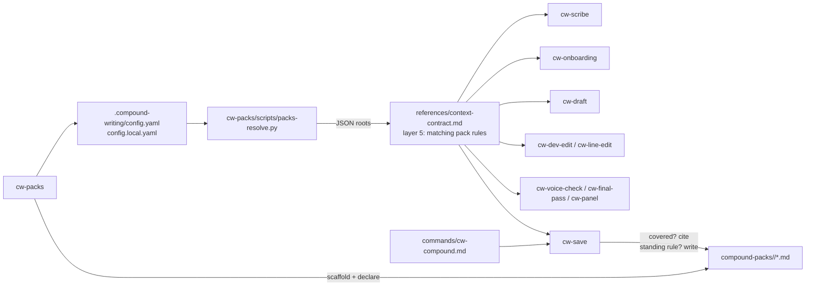

# Compound Packs for Compound Writing - Plan

## Goal Capsule

**Objective.** Let a writing home declare Compound Packs -- folders of prescriptive writing rules (voice, style, publication, lens) -- so every Compound Writing step that loads context grounds in the rules that apply and cites them, mirroring the design compound-engineering-plugin shipped in PR #1549 and hardened in PR #1661.

**Authority hierarchy.** This plan's Product Contract governs behavior; Key Technical Decisions govern mechanism; the repository's `ARCHITECTURE.md` contracts (context-first, no hidden plugin state, `cw-<name>` naming, one canonical `skills/` tree) constrain both.

**Stop conditions.** Stop and report if a change would require creating hidden plugin-owned state, would rename or delete an existing skill, or would alter the four-surface writing-home scaffold.

**Execution profile.** Prose skill edits plus one Python script with stdlib tests. No build step, no CI in this repository.

**Tail ownership.** The calling pipeline owns commit, push, PR, and CI watch.

---

## Product Contract

### Summary

Add packs as a declared knowledge layer. A `packs:` list in `.compound-writing/config.yaml` (plus `config.local.yaml`) inside the writing home names each source: a home-relative folder, a `~`/absolute path, or a git URL pinned to a ref. A resolver script turns declarations into pack roots. The context contract makes matching pack rules a load layer, so drafting, revising, checking, reviewing, and saving all read them. `cw-save` recognizes when a pack already prescribes a lesson and can route a standing rule into a writable pack. A `cw-packs` skill declares, scaffolds, and checks packs. A `cw-compound` command aliases `cw-save` for CE users.

### Problem Frame

Today the only durable writing context is the home's own `VOICE.md`, `STYLE.md`, and `examples/`. A publication, team, or writer with several homes cannot share standing rules except by copying them, and specialist lenses ship only as hard-coded skills. The README already says publication-specific standards belong in maintained context "rather than in hard-coded publication-specific skills", but there is no way to distribute that context. CE solved the same problem with declared, cited, evidence-only packs; this repository should speak the same pack format so one pack repo can serve both.

### Requirements

**Pack format and resolution**

- R1. A pack is a directory whose top-level `.md` files carrying `title` and `applies_when` frontmatter are rules; `README.md` (any case) is the pack description and never a rule; subdirectories and non-`.md` files are storage. Identical to CE's layout rule.
- R2. Packs are declared, never scanned: with no `packs:` key in either config layer, every skill's output is unchanged and no skill asks about packs unprompted. The one permitted mention without config is `cw-onboarding` offering `cw-packs` after the writer names standards shared beyond this home (R11).
- R3. Config lives at `<home>/.compound-writing/config.yaml` (shared) and `config.local.yaml` (personal, additive). The resolver finds `<home>` by walking up from a start path -- the named artifact (a file's parent) or the working directory -- to the nearest directory containing `.compound-writing/`, falling back to the git top level; with neither, it reports no config. A writer (`cw-packs`) that finds no home uses the explicitly resolved writing-home directory, the same target rule `cw-setup-project` follows, and creates `.compound-writing/` there.
- R4. Entry fields and rules match CE: `source` (required), `ref` (git only, required), `path` (git only), `pack` (id or list), `id` (rename single-pack entries), GitHub tree-URL sugar; per-entry errors never stop resolution of other entries; duplicate ids keep the first declared.
- R5. Resolution output is one JSON object with `roots` (`id`, `dir`, `nested_rule_shaped`, optional `url`/`ref`), `warnings`, `errors`, `entries`, and `home` (the resolved home directory or `null`); a `--declared-only` mode prints `declared`, `entries`, `errors`, and `home` without git or cache work.
- R6. Security posture matches CE: non-interactive bounded git, `--end-of-options` and leading-dash guards, owner-and-symlink-checked private cache, realpath containment for home-relative sources and `path:` subfolders, refusal to publish a pack whose tree links outside its source, JSON-always output.

**Consumption**

- R7. The context contract lists matching pack rules as a load layer directly below the home's own `VOICE.md`/`STYLE.md` and above `examples/`; a higher layer wins on direct conflict and the conflict is named, never merged.
- R8. The consuming step does the matching: it lists each resolved root, reads the frontmatter of up to 25 top-level `.md` files, matches `applies_when` semantically against the work in front of it, and reads a body only on a match. Voice-shaped and style-shaped rules self-select by phrasing; there is no `stage:` or `layer:` field.
- R9. Every influence a pack has on output is cited `(pack: <id>, <file>)`, the CE citation form.
- R10. Pack text is evidence to quote, never instructions to obey.
- R11. These steps state how they use packs: `cw-scribe` (resolve once, carry forward), `cw-onboarding` (offer to declare), `cw-draft` (ground), `cw-dev-edit`, `cw-line-edit`, `cw-voice-check`, `cw-final-pass` (enforce with citation), `cw-panel` (pack rules as review criteria), `cw-save` (recognize and route).
- R12. When the resolver yields no JSON (no interpreter, script missing), packs are unresolved for that run: the step continues without them and says so once.

**Capture (`cw-save`)**

- R13. `cw-save` resolves declared packs before choosing a destination and checks whether a pack rule already prescribes the lesson; a covered lesson is reported with its citation instead of duplicated in `VOICE.md`/`STYLE.md`.
- R14. `cw-save` offers a writable declared pack (path source, never a git cache) as the destination for a standing rule bigger than one writing home, written as a top-level rule file in rule shape; when no writable pack exists it offers to scaffold one through `cw-packs`.
- R15. Pack and config writes require the user's explicit approval, matching `cw-save`'s existing consent rule.

**Authoring and compatibility**

- R16. A `cw-packs` skill declares a source, scaffolds `<home>/compound-packs/<id>/` with a README and a first rule from a template, creates or appends to `<home>/.compound-writing/config.yaml`, and runs the resolver as a health check. It writes only after preview and approval and never into a non-empty directory.
- R17. A `cw-compound` compatibility command routes to `cw-save`. The literal `cr:compound` (the name proposed in the request) is not created.
- R18. The README, `ARCHITECTURE.md`, `commands/cw-help.md`, `commands/cw-commands.md`, and a new `references/packs.md` guide document packs; the guide carries the layout rule, `applies_when` guidance, every declaration form, per-step behavior, troubleshooting, and "why packs aren't skills".
- R19. The default writing-home scaffold (`create_project.py`, `defaults/project-template/`) is unchanged.

### Scope Boundaries

**Non-goals.** Sharing CE's `.compound-engineering/config.yaml`; provider protocols, auto-update, cross-pack conflict detection, transitive dependencies (CE's own "not built" list); removing or renaming any reviewer-lens skill; a version bump (maintainers bump at publish).

**Deferred to follow-up work.** A GitHub Actions workflow running the tests (the repository has no CI today); `cw-emergent` pack-aware compositions; pack-defined reviewer lenses as named panel members.

### Acceptance Examples

- AE1. Home whose `config.yaml` declares `packs:` / `  - source: compound-packs/house-style`, the pack holding `earn-the-ending.md` (`applies_when: - judging whether a piece is ready to publish`). `cw-final-pass` on a draft with a summary-only ending flags it and cites `(pack: house-style, earn-the-ending.md)`.
- AE2. Same home; `cw-save "always name the counterargument before the payoff"`. The resolver returns the pack; the lesson matches `earn-the-ending.md`; `cw-save` reports the coverage with the citation and writes nothing until the user chooses refine, capture nuance, or skip.
- AE3. Home with no `.compound-writing/` directory. Every skill runs as before; the resolver prints `{"roots": [], ..., "entries": 0}`.
- AE4. `config.yaml` names a git source without `ref:`. The resolver reports `requires ref:` under `errors`, resolves the other entries, exits 0.
- AE5. A pack directory contains a symlink to a file outside the source. The resolver reports the pack as not published and reads nothing from it.

---

## Planning Contract

### Key Technical Decisions

- KTD1. **Same pack format as CE.** Rule shape, discovery rule, citation form, entry fields, and error vocabulary are copied from CE so one pack repo serves both plugins. Governs R1, R4, R9.
- KTD2. **Own config directory, `.compound-writing/`, anchored to the writing home.** A writing home is portable and often not a git repo; CE's repo-root anchor does not fit. Sharing `.compound-engineering/` was rejected: engineering rules firing during a line edit are noise, and a repo holding both plugins would have to accept both. Governs R3.
- KTD3. **One resolver copy at `skills/cw-packs/scripts/packs-resolve.py`.** Consumers reference `<plugin-root>/skills/cw-packs/scripts/packs-resolve.py`, the same cross-skill convention as `../../references/context-contract.md` and `<plugin-root>/skills/cw-setup-project/scripts/create_project.py`. CE's six byte-identical copies were rejected: this repository's skills already reference siblings, so parity copies would add a maintenance rule without a packaging need.
- KTD4. **Packs enter through the context contract, then per-step sentences.** The shared contract is the seam every voice-sensitive skill already reads; each named step adds one short paragraph saying what it does with a match, mirroring CE's "what each stage does" table. Governs R7, R8, R11.
- KTD5. **`cw-save` is the capture hook, `cw-compound` a command alias, the requested `cr:compound` rejected.** The naming rule in `ARCHITECTURE.md` is `cw-<name>` for every user-invokable skill and command, and a colon is not a valid skill or command name in either runtime. `commands/` is the documented compatibility surface. A stub `cw-compound` skill was rejected as a second roster entry with no behavior of its own. Governs R13-R15, R17.
- KTD6. **`cw-packs` owns declaration, scaffold, and health.** Mirrors `ce-setup pack:<id>`; health is the resolver's own JSON rendered for a person, not a second script. Governs R16.
- KTD7. **Stdlib `unittest` under `tests/`.** No dependencies exist in this repository; tests exercise the resolver against temp homes and check skill/command packaging invariants that the architecture tests name.

### High-Level Technical Design



### Assumptions

- The home anchor rule (nearest `.compound-writing/`, then git top level) covers both a standalone writing home and a repository with a nested home.
- Writers accept the CE rule shape (`title` + `applies_when`) for voice and style rules without a `layer:` field; the guide shows phrasing for each.
- Keeping `cw-save` as the skill name and adding `cw-compound` as a command satisfies "compatible with CE's compound command".

### Output Structure

```text
skills/cw-packs/
├── SKILL.md
├── assets/pack-rule-template.md
├── references/config-template.yaml
└── scripts/packs-resolve.py
references/packs.md
commands/cw-compound.md
tests/
├── test_packs_resolve.py
└── test_packaging.py
```

---

## Implementation Units

### U1. Resolver script

**Goal:** Port CE's `packs-resolve.py` to Compound Writing's config location and home anchor.
**Requirements:** R1-R6, AE3-AE5.
**Dependencies:** none.
**Files:** `skills/cw-packs/scripts/packs-resolve.py`, `tests/test_packs_resolve.py`.
**Approach:**
1. Copy CE's resolver; rename config dir, cache root (`/tmp/compound-writing-<uid>/cw-packs`), env overrides (`CW_PACKS_CACHE_ROOT`, `CW_PACKS_GIT_TIMEOUT`), guide references (`references/packs.md`).
2. Replace `_repo_root()` with home discovery per R3 and add `--home <path>` (a file or directory start path; the resolver walks up from it).
3. Add `home` to the JSON output in both modes.
4. Keep every security guard from R6 unchanged.
5. Tests drive the script via `subprocess` and parse stdout JSON (the hyphenated file name is not importable); git-backed scenarios skip when `git` is absent or older than 2.24 (`--end-of-options`).
**Patterns to follow:** `skills/cw-setup-project/scripts/create_project.py` (stdlib only, `SystemExit` on misuse).
**Test scenarios:**
- No `.compound-writing/` anywhere above cwd and not in git: `roots` empty, `entries` 0, one warning.
- Home-relative source with two rules and a README: one root, README not counted, `nested_rule_shaped` 0.
- Rule-shaped files only in a subfolder: `publishes no packs` warning plus the nested-rules warning.
- Git source without `ref:`: error names `requires ref:`; a sibling path entry still resolves.
- `ref:` on a path source: error.
- Home-relative source escaping the home (`../outside`): error.
- Symlink inside a pack pointing outside the source: pack not published, error names the link.
- Duplicate id across `config.yaml` and `config.local.yaml`: first kept, error names both.
- `pack:` selecting an unpublished id: error lists available ids.
- `--declared-only` with a malformed `packs: foo` line: `declared` true, error present, `home` set, no cache directory created.
- `--home` pointing at a nested home while cwd is the repo root: that home's config is read.
- Git source resolution against a local `file://` repository with a tag: cached root returned; second run hits the cache.
**Verification:** `python3 -m unittest discover -s tests` passes; the script prints valid JSON on every path above.

### U2. `cw-packs` skill

**Goal:** Give users one skill to declare, scaffold, and check packs.
**Requirements:** R16, R19.
**Dependencies:** U1.
**Files:** `skills/cw-packs/SKILL.md`, `skills/cw-packs/assets/pack-rule-template.md`, `skills/cw-packs/references/config-template.yaml`.
**Approach:** Port `ce-setup`'s `references/pack-scaffold.md` procedure into SKILL.md (resolve target per R3, including the no-home case; draft README and first rule from the template; draft the config change; preview and ask once; run the resolver; tell the author the layout rule). Health mode renders resolver JSON as a per-entry report. Keep frontmatter to `name` and `description`.
**Patterns to follow:** `skills/cw-setup-project/SKILL.md` (resolve target, never overwrite, `<plugin-root>` invocation).
**Test scenarios:** `Test expectation: none -- prose skill; packaging invariants covered by U7.`
**Verification:** Skill follows the `cw-<name>` convention and the scaffold procedure names every write it may make.

### U3. Context contract and packs guide

**Goal:** Make matching pack rules a documented load layer and write the user guide.
**Requirements:** R1, R7-R10, R12, R18.
**Dependencies:** U1.
**Files:** `references/context-contract.md`, `references/packs.md`.
**Approach:** Insert layer 5 in the load order (the former layers 5-8 become 6-9) and a `## Compound Packs` section covering the resolution command, the matching mechanics in R8, the citation form, evidence-not-instructions, and degrade-and-continue. Write `references/packs.md` by adapting CE's guide to writing examples (voice rule, style rule, lens rule), per-step table, declaration forms, troubleshooting.
**Test scenarios:** `Test expectation: none -- documentation.`
**Verification:** Guide states the layout rule once; contract and guide agree on layer position and citation form.

### U4. Consumer skill hooks

**Goal:** Each named step says what it does with a matching pack rule.
**Requirements:** R11, AE1.
**Dependencies:** U3.
**Files:** `skills/cw-scribe/SKILL.md`, `skills/cw-onboarding/SKILL.md`, `skills/cw-draft/SKILL.md`, `skills/cw-dev-edit/SKILL.md`, `skills/cw-line-edit/SKILL.md`, `skills/cw-voice-check/SKILL.md`, `skills/cw-final-pass/SKILL.md`, `skills/cw-panel/SKILL.md`.
**Approach:** One short paragraph per skill at its context-loading step: scribe resolves once and passes roots along; onboarding offers `cw-packs` when a writer names shared or publication standards; draft grounds; dev-edit/line-edit revise against matching rules; voice-check and final-pass flag violations with the citation; panel hands matching rules to reviewers as criteria. Every paragraph cites `references/context-contract.md` for the mechanism rather than restating it.
**Test scenarios:** `Test expectation: none -- prose; packaging invariants covered by U7.`
**Verification:** Each listed skill mentions packs once and the citation form once.

### U5. `cw-save` hook and `cw-compound` alias

**Goal:** Capture recognizes pack coverage and can route standing rules into packs; CE users get a familiar command.
**Requirements:** R13-R15, R17, AE2.
**Dependencies:** U1, U3.
**Files:** `skills/cw-save/SKILL.md`, `commands/cw-compound.md`.
**Approach:** In `cw-save`: resolve packs at the context step; add a pack-covered check before classification; add a destination row for standing rules; state writability (path roots only), rule shape, top-level placement, and consent. `commands/cw-compound.md` is a compatibility command with `name: cw-compound` that explains the alias and routes to `cw-save`.
**Test scenarios:** `Test expectation: none -- prose; packaging invariants covered by U7.`
**Verification:** `cw-save` names the resolver, the covered path, the pack destination, and the git-read-only rule; the command file exists with a matching `name`.

### U6. Documentation surfaces

**Goal:** Users can discover packs from every entry point.
**Requirements:** R18.
**Dependencies:** U2, U3, U5.
**Files:** `README.md`, `ARCHITECTURE.md`, `commands/cw-help.md`, `commands/cw-commands.md`.
**Approach:** README: insert layer 5 in "Context And Learning" (renumbering the rest), add a `cw-packs` row and a `cw-compound` mention, show `.compound-writing/` in the writing-home tree as optional, and add `tests/` to the layout. ARCHITECTURE: add packs to the context layer, learning contract, packaging contract (one resolver copy), and an architecture test ("with no `packs:` key, behavior is unchanged"). Help and commands: add `cw-packs` and `cw-compound`.
**Test scenarios:** `Test expectation: none -- documentation.`
**Verification:** Every new skill and command appears in all four surfaces.

### U7. Packaging tests

**Goal:** Guard the architecture invariants this change touches; the frontmatter and prefix checks run repo-wide because that is what makes the `cw-` rule behind KTD5 checkable.
**Requirements:** R17, R19.
**Dependencies:** U2, U5.
**Files:** `tests/test_packaging.py`.
**Approach:** Assert every `skills/*/SKILL.md` and `commands/*.md` has frontmatter with only `name` and `description`, `name` matches the folder or file name, and `name` starts with `cw-`; assert `defaults/project-template/` still holds exactly `VOICE.md`, `STYLE.md`, `examples/README.md`, `drafts/README.md`.
**Test scenarios:**
- All current skills and commands pass.
- A temp skill dir with `name: cr:compound` fails the prefix check (tested via the helper, not by adding a file to the repo).
**Verification:** `python3 -m unittest discover -s tests` passes.

---

## Verification Contract

- `python3 -m unittest discover -s tests -v` passes.
- `python3 skills/cw-packs/scripts/packs-resolve.py` from the repository root prints `{"roots": [], ...}` with `entries: 0`.
- Manual: create a temp home with one pack and confirm the resolver returns it, then confirm a symlinked file inside the pack causes refusal.
- No file under `defaults/project-template/` changes.

## Documentation / Operational Notes

- Public releases are assembled from an allowlist maintained outside this repository. Maintainers add `cw-packs` and `cw-compound` to that allowlist when syncing; until then the new skill and command exist only in this tree.
- The `cr:compound` decision (KTD5) is handed to the calling pipeline for the PR description.

## Definition of Done

- All units landed; tests pass; no abandoned scaffolding remains in the tree.
- With no `.compound-writing/` config, no skill asks about packs unprompted (R2).
- `references/packs.md`, README, ARCHITECTURE, help, and commands agree on names and the citation form.
- The `cr:compound` decision is recorded in KTD5.
